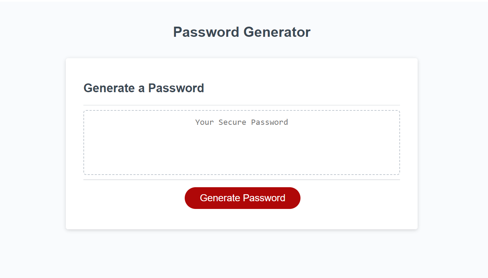

# 03 JavaScript: Password Generator

## Overview

This is a password generator. The process of generating a password begins by asking the user a few questions to gather their password criteria and if they would like to use certain character types -

-how long the user would like their password to be, must be 8-128 characters
-upper case letters
-lower case letters
-numbers
-special characters

Once the user has defined their criteria, a randomized password will be displayed in the text box.

## Built With

Currently all code is written in Javascript, HTML, and CSS.

## License

MIT (https://choosealicense.com/licenses/mit/)

## Project Status & Future Features

The password generator is great as is and all is functional and working. Some future improvements could be -

-adding all password criteria questions to be visual toggles to switch on or off
-adding a copy to clipboard button so the user can easily copy their new password

Github repo: https://github.com/NicoleBrubaker/Password-Generator
Live site: https://nicolebrubaker.github.io/Password-Generator/

